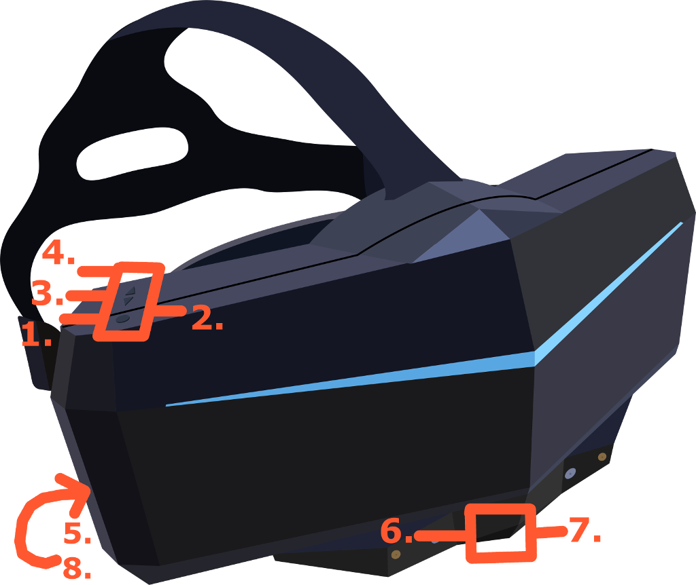

# Pimax 8k headset and controller input

## Pimax controllers

As of the writing of this document Pimax does not provide their own controllers. Although they have their own controllers and base-stations under develoment.

Until then, Pimax is compatible with HTC vive base stations and controllers.

Once the controller ships it is belived that it will come with both a trackpad as well as a thumbstick confiuration. It is also reported to have detection for ring and pinky fingers on the controllers grip, suggesting that Pimax intends the controller to be compatible with future generation controllers such as the Vive Index.

In the meantime, and as a general good practice guide, it is reccomended that VR applications and games should try to conform to input schemes that will function across the majority of desktop vr platforms.

## Standard input layout across other VR devices

> This guide refers to Oculus touch, Vive, and Windows Mixed Reality controllers specifically. And which of those inputs are compatible with Pimaxes input interface.

As standard most desktop VR platforms share some similarities in their hardware. They use two 6-dof (degrees of freedom) controllers, and a single 6-dof position for the users head. 

Controllers are usually symetrical, in that they contain equal numbers of inputs for each hand. This includes a trigger, a touchpad or a thumbstick, a button that is activated when the thumbstick or touchpad is pressed, a grip button, a system button (home or settings), and a grip button. Buttons and triggers usually sensitive enough to detect when they're touched as well as pressed.

Some variation exists. Oculus touch controllers contain additional face buttons, and Windows Mixed Reality controllers contain both thumbsticks and touchpads. Pimax does not always support unique features like these. The SDK seems to be focused around compatibility with the HTC Vive, which should be kept in mind when developing an input sceme for your own projects.

## Pimax headset

The pimax has some hardware inputs to provide system functionality.

  

1.  Power button
2.  Light indicator*
3.  Volume up
4.  Volume down
5.  Lens adjustment
6.  USB-C expansion port
7.  Microphone
8.  3.5mm Headphone port

* The light indicator has various meanings.
1.  Red: The headset is not plugged into the power adapter or interface.
2.  Green: The headset is running as intended.
3.  Purple: Parallel projection is enabled.
4.  Blinking: Device Firmware Update mode. Consider contacting technical support if an issue persists.

## Using PVRInputEvent with Vive controllers

Input with Pixmax is provided 

### Next: Building an executable

See [Building an executable](/docs/building-pimax-exe.md)
