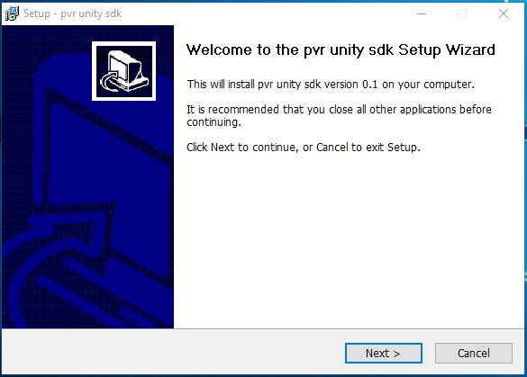
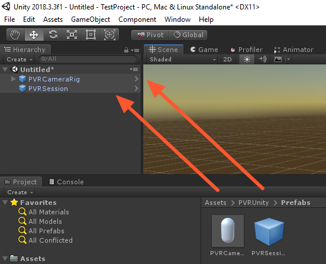
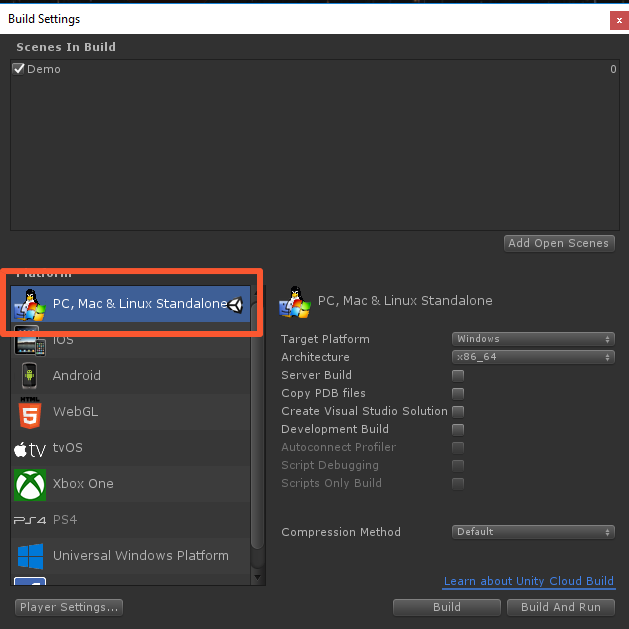
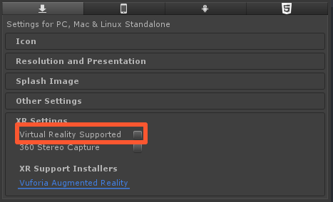

# Pimax Unity SDK Installation

## Importing the unitypackage

The Pimax Unity VR SDK comes as a .unitypackage that you can import into your project via the **Assets › Import Package › Custom Package...** menu option in Unity.

To access the .unitypackage Pimaxes SDK installer must be run, which by default will install the file to: **C:\Program Files\Pimax\Sdk\Unity_plugin**.

  

If the package has been installed and imported correctly you should see a folder named 'PVRUnity' appear in your project assets.

> TODO: Download link should be updated to allow SDK access through site.

You can <a href="https://users.wearvr.com/developers/devices/pimax/resources/vr-unity-package" target="_blank">download the Pimax Unity SDK</a> from WEARVR. You will be asked to create or sign in to your developer account.

## Setting up the scene

Once the .unitypackage has been imported the PVR SDK can be utilized by dragging the prefabs **'PVRSession'** and **'PVRCameraRig'** into the scene. 

The MainCamera object, or whichever object your own game uses as it's main camera, should be removed.

  

## Project settings

### Build Settings

Apps built for Pimax should target **'PC, Max & Linux Standalone'** as their build platform.

  

In **'Edit->Project Settings->Player->Settings for PC, Max & Linux Standalone->Other Settings'** set **'Virtual Reality Supported'** to **'disabled'**.

  

### Next: Controller and headset inputs

See [Controller and headset inputs](/docs/pimax-controllers.md)
