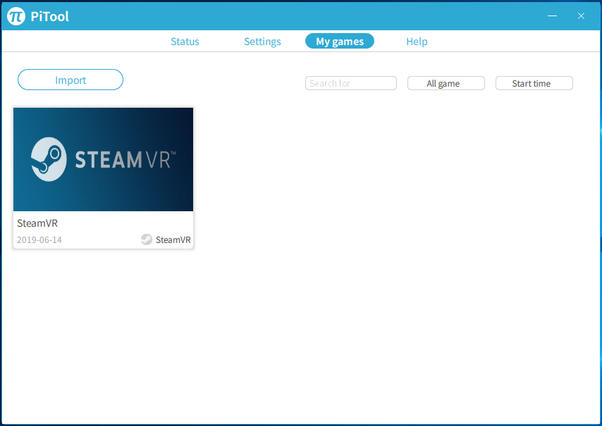

# Understanding PiTool

> This guide is up to date until PiTool version 1.0.0.132

PiTool is the Pimax headsets companion application. It must be running if the Pimax hardware is to be used, and acts as both an interface between other hardware and as a manager to enable Pimax specific functionality.

## Installing PiTool

PiTool can be installed from the PiMax website, [Here.](https://pimaxvr.com/pages/pitool)

As well as installing PiTool is highly recommended that your NVIDIA Graphics Card drivers be updated to their latest available version. If an update was applied you should also perform a full restart on your system before attempting to use the PiMax, to allow the changes to take effect.

From the PiMax website you should be able to download an installer for PiTools named **'PiToolSetup_-version number-.exe'**. Once opened follow the installation instructions, including selecting a Language and selecting whether to create a desktop shortcut. After a brief installation procedure the installer will close, and allow you to open PiTools for use.

If you allowed the installer to do so, a shortcut to **PiTool** will appear on your computers Desktop. PiTool may also launch automatically when a PiMax headset is connected to your computer on startup.

  

## PiTool UI

Once PiTool is installed and launched you will be presented with several screens. Each of which is briefly described here.

### Status

  

The main status screen shows the connection status of your Pimax headset, and offers error codes and suggestions to help resolve any connectivity issues. Additionally, it also displays the connection status of other peripherals such as controllers and base stations.

From here PiTool can launch SteamVR, pair controllers, and perform room scale setup. If the room and controllers have already been set up via SteamVR these steps are unnecessary.

### Settings

  

The settings screen is divided into 3 sub-sections. General, HMD, and Brainwarp.

General settings allows the user to check PiTool for updates, change the active Language, and change the default behavior of the PiTools window. This section is relevant to the operation of PiMax and PiTools as a whole.

Using the Restore button in the lower right hand corner revert PiTool back to it's default settings.

  

  

The settings screen is divided into 3 sub-sections. General, HMD, and Brainwarp.

HMD (Head Mounted Display) settings allows the user to change settings relating to the headset display itself, particularly in how it runs during virtual reality experiences. From here the user can update the headsets firmware and enable or disable 6 degrees-of-freedom tracking.

'Render Quality' is a slider that can be used to increase or decrease the visual clarity of the Pimax as a whole. It is not recommended to increase this to very high levels, as it can be very demanding on most hardware and suffers from diminishing returns. Lowering this slider is an effective way to increase performance and frame-rate.

This section also allows the user to alter the visual properties of PiMax, and allows for changes in contrast and brightness on a per-eye basis for each of the PiMax screens. IPD (interpupillary distance) can also be set here, which allows for additional control over screen-to-eye positions when used with the hardware's lens adjustment dial.

Finally, the Headset or the PiMax interface can be completely rest using the 'Reboot HMD' or 'Restart Service' buttons.

Using the Restore button in the lower right hand corner revert PiTool back to it's default settings.

  

The settings screen is divided into 3 sub-sections. General, HMD, and Brainwarp.

Brainwarp is the name PiMax has given it's suite of experimental features.

Smart smoothing attempts to predict the users movement and render intermediate frames in the users vision. If successful this technique would make the display on the headset appear smoother, and could help mitigate latency issues.

Parallel projections should be enabled or disabled on a per-game basis. This can cause some visual issues, or affect performance, if set incorrectly.

'Compatible with Vive Only Game' attempts to make the Pimax emulate Vive. This may be necessary to play VR experiences not developed using OpenVR or other cross-platform solutions.

'Feild Of View' allows the user to increase or decrease the angle of the Pimax's vision.

'Refresh Rate' is set to PiMax's maximum of 80hz by default, however this can be lowered to reduce screen-tearing if necessary.

### My Games

  

The 'My Games' screen shows a library of PiMax compatible applications. This list will automatically be populated by titles as the devices is used, however programs can also be manually entered using the 'Import' button.

Titles in this screen can be sorted and searched. They can also be launched from this screen.

### Help

  

The Help screen contains contact details for PiMax, as well as a reference to it's privacy Policy (In Chinese). 

This screen also allows the user to review Export Logs, and to attempt a diagnostic of system hardware. The Diagnostic tool can be uses to detect required updates to USB drivers, system versions, drivers and Steam.
